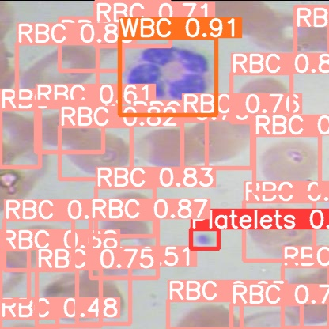

## BCCD - Idetification and Visualization with AI

This is an AI project that uses the YOLOv5 model to train an algorithm to locate and identify different blood cells. The images used to train and test the algorithm is taken from the BCCD dataset.

The project was made in Google Colaboratory, mostly because the project needs to process a lot of images and is therefore GPU intensive. My PC is capable of this, but my school laptop has no dedicated GPU and cannot process the images in any reasonable amount of time. Coloab allows hardware acceleration, including GPUs, so the project can be run on any computer within about 20 min.

This project uses:
* YOLOv5 by ultralytics - https://github.com/ultralytics/yolov5
* ROBOFLOW - https://app.roboflow.com/
* The BCCD dataset - https://github.com/Shenggan/BCCD_Dataset (the version used is was taken from ROBOFLOW)
